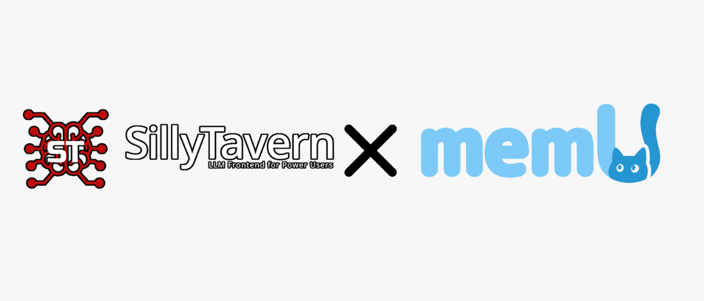

<div align="center">

REQUIRES:<br>
https://github.com/mekineer-com/memu/<br>
https://github.com/mekineer-com/memu-sillytavern-extension/

Community fork (unofficial).<br>
Upstream: (https://github.com/NevaMind-AI/memu-sillytavern-plugin)<br>
Purpose: SillyTavern integration + memU bridge improvements (Local/API routing, build fixes, etc.).<br>
Not affiliated with upstream/app.memu.so.<br>
License: see LICENSE (upstream license applies).



### MemU Plugin for SillyTavern

Server plugin to proxy the memu SDK. Required by [MemU-Extension](https://github.com/NevaMind-AI/memu-sillytavern-extension).

</div>

---

## How to install

1. Before you begin, make sure you set a config `enableServerPlugins` to `true` in the config.yaml file of SillyTavern.

2. Open a terminal in your SillyTavern directory, then run the following:

```bash
cd plugins
git clone https://github.com/mekineer-com/memu-sillytavern-extension
```

3. Restart the SillyTavern server.

## How to build

Clone the repository, then run `npm install`.

```bash
# After your edit
npm run build
```


---

## Config: `memu-plugin.config.json`

This plugin stores its settings in a file named `memu-plugin.config.json` in your **SillyTavern root folder** (the same folder that has `config.yaml`).

- The file is **auto-created** the first time the plugin runs.
- The MemU browser extension normally updates it by calling `GET/POST /api/plugins/memu/config`.

### Local mode: how the plugin finds memU

In **local mode**, the plugin launches a small Python bridge (`py/memu_st_bridge.py`). That bridge requires the Python package **`memu`** to be installed in the Python interpreter you use.

You have two options:

1) **Use system Python**
   - Install memU into the same Python that runs when you type `python3` (Linux/macOS) or `python` (Windows).
   - Then you can leave `pythonCmd` unset.

2) **Use a venv (recommended)**
   - Set `pythonCmd` to the Python inside your memU venv.
   - Examples:
     - Linux/macOS: `/path/to/memu/.venv/bin/python`
     - Windows: `C:\path\to\memu\.venv\Scripts\python.exe`

You can also override the Python command with an environment variable:

- `MEMU_PYTHON=/path/to/python`

If memU can’t be imported, the plugin will now return a clear error message (and list what it tried) at `/api/plugins/memu/health`.


## License

AGPLv3


### memU v1.4+ only
This release targets memu-py >= 1.4.0. The local Python bridge will warn in logs if it detects an older memU install.
